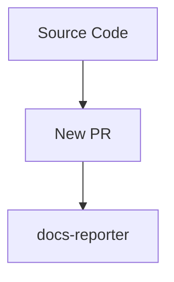
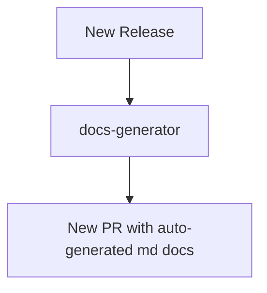

# TBDocs

[](https://github.com/super-linter/super-linter)


Tool for automating docs generation from source codes docs annotations (like
TSDocs, JavaDocs, JsDocs etc.) to SSG websites that supports markdown (like
Docusaurus, Hugo, Jekyll etc.).

We are in the MVP phase testing **TSDocs -> Docusaurus only**.

## Overview

TBDocs has two main components:

- **docs-reporter**: scan your codebase to find docs annotations errors or
  accidental apis exposures, undocumented apis, forgotten apis that should be
  exposed.
- **docs-generator**: scan your codebase to extract all the docs annotations and
  generate markdown files.

**CI: Regular PRs against main branch:**



**Cutting new Releases Automated Docs generated to target Docs repo:**



### Supported Pipelines

**Typescript**

- docs standard: [TSDoc](https://tsdoc.org/)
- docs-reporter:
  [api-extractor](https://api-extractor.com/pages/overview/intro/)
- docs-generator:
  [typedoc-plugin-markdown](https://github.com/tgreyuk/typedoc-plugin-markdown)

## GH Action Setup

See a few examples of how to include the tbdocs GH Action on your pipeline.

### Running the docs-reporter on CI checks

This is generally used for PRs against main, it will generate a report with all
the docs warnings and errors that the reporter found in a comment on your PR.

```yml
# after ts build step
- name: TBDocs Reporter
  id: tbdocs-reporter
  uses: TBD54566975/tbdocs@main
  with:
    token: ${{ secrets.GITHUB_TOKEN }}
    report_changed_scope_only: false # change to true to report only changed files
    fail_on_error: false
    entry_points: |
      - file: packages/protocol/src/main.ts
        docsReporter: api-extractor
```

PS: you can add multiple entry points, it's a YAML list.

### Running the docs-reporter + docs-generator on the Release process

This will run the doc-reporter as above but it will also run the markdown docs
generator and open a PR against the target repo (the SSG website which knows how
to render Markdown, think docusaurus, hugo etc.).

You will want to do this generally on Release PRs or Release automation, so that
the docs are being published when new versions of the APIs are being released to
the public.

```yml
# after ts build step
- name: TBDocs Reporter
  uses: TBD54566975/tbdocs@main
  with:
    token: ${{ secrets.GITHUB_TOKEN }}
    fail_on_error: true # you probably want to block releases with errors
    fail_on_warnings: true # depends on your project docs diligence
    docs_target_owner_repo: 'TBD54566975/developer.tbd.website'
    docs_target_branch: 'tbdocs_tbdex-js_protocol_release'
    docs_target_pr_base_branch: 'main'
    entry_points: |
      - file: packages/protocol/src/main.ts
        docsReporter: api-extractor
        docsGenerator: typedoc-markdown
        targetRepoPath: site/docs/tbdex/api-reference/tbdex-js/protocol
      - file: packages/http-client/src/main.ts
        docsReporter: api-extractor
        docsGenerator: typedoc-markdown
        targetRepoPath: site/docs/tbdex/api-reference/tbdex-js/http-client
```

PS: if you like to expose the docs of unstable/next versions you could put this
config also for merges against the `main` branch.

### GH Action Inputs Parameters

See the commented GH Action input parameters definition on
[action.yml](./action.yml).

If they are not detailed enough, please feel free to open an issue!

#### Allowed `docs_reporter` and `docs_generator` combinations values

- **Typescript:**
  - docs_reporter: `api-extractor`
  - docs_generator: `typedoc-markdown`

## Development Setup

After you've cloned the repository, you'll need to perform some initial setup
steps before you can develop your action.

> [!NOTE]
>
> You'll need to have a reasonably modern version of
> [Node.js](https://nodejs.org) handy. If you are using a version manager like
> [`nvm`](https://github.com/nvm-sh/nvm), you can run `nvm use` in the root of
> the repository. Otherwise, 20.x or later should work!

1. :hammer_and_wrench: Install the dependencies

   ```bash
   npm install
   ```

1. :building_construction: Package the TypeScript for distribution

   ```bash
   npm run build
   ```

1. :white_check_mark: Run the tests

   ```bash
   npm test
   ```

### Running locally

The following will run the `tbdocs` action against this own repo. It should run
the docs-reporter which will print the report warnings (and also store a few
reporter files in `.tbdocs/reporter`) in the console log, and also generate the
docs markdown files in the folder `.tbdocs/docs`.

```sh
export GITHUB_REPOSITORY=test-user/test-repo
export GITHUB_STEP_SUMMARY='../tbdocs-summary.md'
touch ../tbdocs-summary.md

node scripts/main.js

# if you want to test multiple packages processing
cd examples/foo && npm i && npm run build && cd ../..
export INPUT_ENTRY_POINTS="
- file: src/index.ts
  docsReporter: typedoc
  docsGenerator: typedoc-markdown
- file: examples/foo/index.ts
  docsReporter: typedoc
  docsGenerator: typedoc-markdown
"
node scripts/main.js
```

### Testing with Docker

The following is useful if you want to test this `tbdocs` against another repo
that you have in your local environment without needing to setup and wait for a
real GH action execution.

```sh
docker build -f Dockerfile . --tag tbdocs:latest

# now from the repo you want to analyze & generate docs
# below is an example of running it from the root of tbdex-js repo
# https://github.com/TBD54566975/tbdex-js
export INPUT_ENTRY_POINTS="
- file: packages/protocol/src/main.ts
  docsReporter: api-extractor
  docsGenerator: typedoc-markdown
- file: packages/http-client/src/main.ts
  docsReporter: api-extractor
  docsGenerator: typedoc-markdown
- file: packages/http-server/src/main.ts
  docsReporter: api-extractor
  docsGenerator: typedoc-markdown
"

docker run -v $(pwd):/github/workspace/ \
   --workdir /github/workspace          \
   -e "GITHUB_REPOSITORY=TBD54566975/tbdex-js" \
   -e "INPUT_ENTRY_POINTS=${INPUT_ENTRY_POINTS}" \
   tbdocs-app
```

### Update the Action Code

1. Create a new branch

   ```bash
   git checkout -b <new-branch-name>
   ```

1. Replace the contents of `src/` with your action code
1. Add tests to `__tests__/` for your source code
1. Format, test, and build the action

   ```bash
   npm run all
   ```

1. Commit your changes

   ```bash
   git add .
   git commit -m "My first action is ready!"
   ```

1. Push them to your repository

   ```bash
   git push -u origin <new-branch-name>
   ```

1. Create a pull request and get feedback on your action
1. Merge the pull request into the `main` branch

Your action is now published! :rocket:

For information about versioning the action, see
[Versioning](https://github.com/actions/toolkit/blob/master/docs/action-versioning.md)
in the GitHub Actions toolkit.
