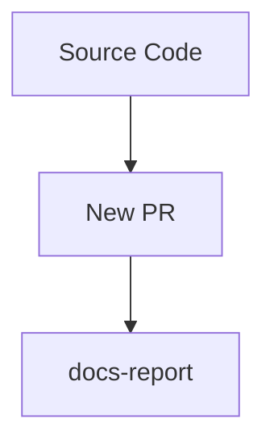
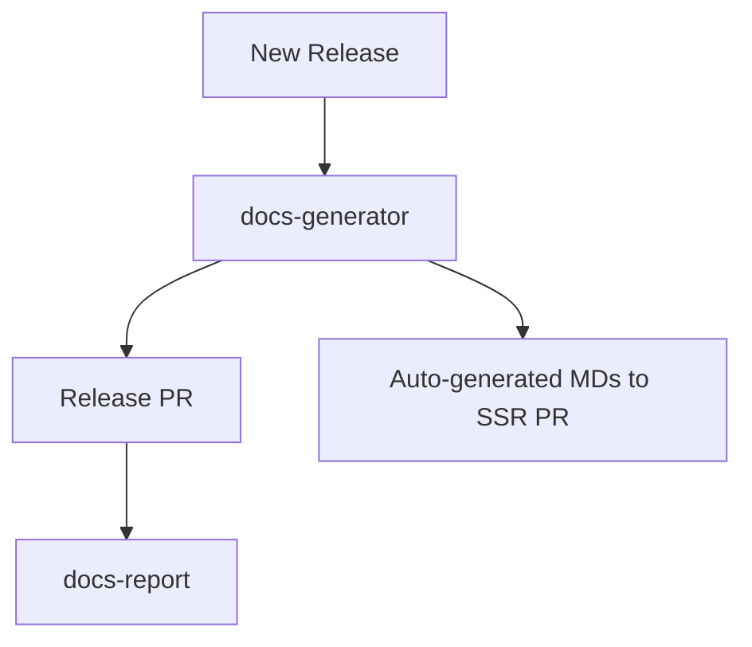

# TBDocs

[](https://github.com/super-linter/super-linter)


Tool for automating docs generation from source codes docs annotations (like TSDocs, JavaDocs, JsDocs etc.) to SSR websites that supports markdown (like Docusaurus, Hugo, Jekyll etc.).

We are in the MVP phase testing **TSDocs -> Docusaurus only**.

## Overview

TBDocs has two main components:
- **docs-report**: scan your codebase to find docs annotations errors or accidental apis exposures, undocumented apis, forgotten apis that should be exposed.
- **docs-generator**: scan your codebase to extract all the docs annotations and generate markdown files.

**Regular PRs against main branch:**



**Cutting new Releases with Release PR + Auto SSR Preview:**


  
### Supported Pipelines

**Typescript**
- docs standard: [TSDoc](https://tsdoc.org/)
- docs-report: [api-extractor](https://api-extractor.com/pages/overview/intro/)
- docs-generator: [typedoc-plugin-markdown](https://github.com/tgreyuk/typedoc-plugin-markdown)

## Initial Setup

After you've cloned the repository to your local machine or codespace, you'll
need to perform some initial setup steps before you can develop your action.

> [!NOTE]
>
> You'll need to have a reasonably modern version of
> [Node.js](https://nodejs.org) handy. If you are using a version manager like
> [`nvm`](https://github.com/nvm-sh/nvm), you can run `nvm use` in the
> root of the repository. Otherwise, 20.x or later should work!

1. :hammer_and_wrench: Install the dependencies

   ```bash
   npm install
   ```

1. :building_construction: Package the TypeScript for distribution

   ```bash
   npm run bundle
   ```

1. :white_check_mark: Run the tests

   ```bash
   $ npm test

   PASS  ./index.test.js
     ✓ throws invalid number (3ms)
     ✓ wait 500 ms (504ms)
     ✓ test runs (95ms)

   ...
   ```

## Running locally

```sh
export GITHUB_REPOSITORY=test/test
node scripts/main.js
```

## Testing with Docker

```sh
docker build -f Dockerfile . --tag tbdocs-app:latest --progress plain

docker run --env GITHUB_REPOSITORY=mock1/mock2 tbdocs-app
```

## Update the Action Metadata

The [`action.yml`](action.yml) file defines metadata about your action, such as
input(s) and output(s). For details about this file, see
[Metadata syntax for GitHub Actions](https://docs.github.com/en/actions/creating-actions/metadata-syntax-for-github-actions).

When you copy this repository, update `action.yml` with the name, description,
inputs, and outputs for your action.

## Update the Action Code

1. Create a new branch

   ```bash
   git checkout -b <new-branch-name>
   ```

1. Replace the contents of `src/` with your action code
1. Add tests to `__tests__/` for your source code
1. Format, test, and build the action

   ```bash
   npm run all
   ```

1. Commit your changes

   ```bash
   git add .
   git commit -m "My first action is ready!"
   ```

1. Push them to your repository

   ```bash
   git push -u origin <new-branch-name>
   ```

1. Create a pull request and get feedback on your action
1. Merge the pull request into the `main` branch

Your action is now published! :rocket:

For information about versioning the action, see
[Versioning](https://github.com/actions/toolkit/blob/master/docs/action-versioning.md)
in the GitHub Actions toolkit.

## Validate the Action

You can now validate the action by referencing it in a workflow file. For
example, [`ci.yml`](./.github/workflows/ci.yml) demonstrates how we are referencing our action in the same repository.

## Usage

After testing, you can create version tag(s) that developers can use to
reference different stable versions of your action. For more information, see
[Versioning](https://github.com/actions/toolkit/blob/master/docs/action-versioning.md)
in the GitHub Actions toolkit.

To include the action in a workflow in another repository, you can use the
`uses` syntax with the `@` symbol to reference a specific branch, tag, or commit
hash.

```yaml
steps:
  - name: Checkout
    id: checkout
    uses: actions/checkout@v3

  - name: Test Local Action
    id: test-action
    uses: actions/typescript-action@v1 # Commit with the `v1` tag
    with:
      milliseconds: 1000

  - name: Print Output
    id: output
    run: echo "${{ steps.test-action.outputs.time }}"
```
