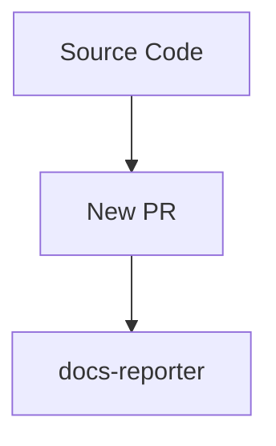
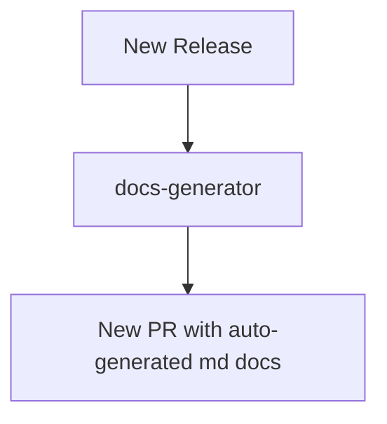

# TBDocs

[](https://github.com/super-linter/super-linter)


Tool for automating docs generation from source codes docs annotations (like
TSDocs, JavaDocs, JsDocs etc.) to SSG websites that supports markdown (like
Docusaurus, Hugo, Jekyll etc.).

We are in the MVP phase testing **TSDocs -> Docusaurus only**.

## Overview

TBDocs has two main components:

- **docs-reporter**: scan your codebase to find docs annotations errors or
  accidental apis exposures, undocumented apis, forgotten apis that should be
  exposed.
- **docs-generator**: scan your codebase to extract all the docs annotations and
  generate markdown files.

**Regular PRs against main branch:**



**Cutting new Releases Automated Docs generated to target Docs repo:**



### Supported Pipelines

**Typescript**

- docs standard: [TSDoc](https://tsdoc.org/)
- docs-reporter: [api-extractor](https://api-extractor.com/pages/overview/intro/)
- docs-generator:
  [typedoc-plugin-markdown](https://github.com/tgreyuk/typedoc-plugin-markdown)

## GH Action Setup

See a few examples of how to include the tbdocs GH Action on your pipeline.

### Running the docs-reporter on CI checks

This is generally used for PRs against main, it will generate a report with all
the docs warnings and errors that the reporter found in a comment on your PR.

```yml
# after ts build step
- name: TBDocs Reporter
  id: tbdocs-reporter-protocol
  uses: TBD54566975/tbdocs@main
  with:
    token: ${{ secrets.GITHUB_TOKEN }}
    project_path: './packages/protocol'
    docs_reporter: 'api-extractor'
    fail_on_error: false # change to true if you want to block on doc errors
```

### Running the docs-reporter + docs-generator on the Release process

This will run the doc-reporter as above but it will also run the markdown docs
generator and open a PR against the target repo (the SSG website which knows how
to render Markdown, think docusaurus, hugo etc.).

You will want to do this generally on Release PRs or Release automations, so 
that the docs are being published when new versions of the APIs are being 
released to the public.

```yml
# after ts build step
- name: TBDocs Reporter
  uses: TBD54566975/tbdocs@main
  with:
    token: ${{ secrets.GITHUB_TOKEN }}
    project_path: './packages/protocol'
    docs_reporter: 'api-extractor'
    fail_on_error: true # you probably want to block releases with errors
    fail_on_warnings: true # depends on your project docs diligence
    docs_generator: 'typedoc-markdown'
    docs_target_owner_repo: 'TBD54566975/developer.tbd.website'
    docs_target_branch: 'tbdocs_tbdex-js_protocol_release'
    docs_target_pr_base_branch: 'main'
    docs_target_repo_path: 'site/docs/tbdex-js/api-reference/protocol'
```

PS: if you like to expose the docs of unstable/next versions you could put this
config also for merges against the `main` branch.

### GH Action Inputs Parameters

Copied from the GH Action definition on [action.yml](./action.yml):

```yml
inputs:
  token:
    description: 'Token used to submit comments summary and open PRs'
    required: false
  project_path:
    description: 'Path to the project root'
    required: false
    default: '.'

  # reporter params
  docs_reporter:
    description: 'Name of the docs reporter tool (skips report if empty)'
    required: false
  fail_on_error:
    description: 'Should it fail on report errors?'
    required: false
    default: 'true'
  fail_on_warnings:
    description: 'Should it fail on report warnings?'
    required: false
    default: 'false'
  api_extractor_json_path:
    description: 'Path to the api-extractor.json file (if you need customization)'
    required: false
    default: ''

  # generator params
  docs_generator:
    description: 'Name of the docs generator tool (skips docs generation if empty)'
    required: false

  # if you want to open a PR with the generated docs
  docs_target_owner_repo:
    description: 'Target owner/repo for the generated docs PR (skips opening a PR if empty)'
    required: false
  docs_target_branch:
    description: 'Target branch for the generated docs PR'
    required: false
    default: 'main'
  docs_target_pr_base_branch:
    description: 'Target base branch for the generated docs PR'
    required: false
    default: 'main'
  docs_target_repo_path:
    description: 'Target repo directory to insert the generated docs'
    required: false
    default: 'docs'
```

#### Allowed `docs_reporter` and `docs_generator` combinations values

- **Typescript:**
   - docs_reporter: `api-extractor`
   - docs_generator: `typedoc-markdown`

## Initial Setup

After you've cloned the repository to your local machine or codespace, you'll
need to perform some initial setup steps before you can develop your action.

> [!NOTE]
>
> You'll need to have a reasonably modern version of
> [Node.js](https://nodejs.org) handy. If you are using a version manager like
> [`nvm`](https://github.com/nvm-sh/nvm), you can run `nvm use` in the root of
> the repository. Otherwise, 20.x or later should work!

1. :hammer_and_wrench: Install the dependencies

   ```bash
   npm install
   ```

1. :building_construction: Package the TypeScript for distribution

   ```bash
   npm run bundle
   ```

1. :white_check_mark: Run the tests

   ```bash
   $ npm test

   PASS  ./index.test.js
     ✓ throws invalid number (3ms)
     ✓ wait 500 ms (504ms)
     ✓ test runs (95ms)

   ...
   ```

## Running locally

```sh
export GITHUB_REPOSITORY=test/test
export INPUT_DOCS_REPORTER=api-extractor
export INPUT_DOCS_GENERATOR=typedoc-markdown
node scripts/main.js
```

## Testing with Docker

```sh
docker build -f Dockerfile . --tag tbdocs-app:latest

# now from the repo you want to analyze & generate docs
docker run -v $(pwd):/github/workspace/ \
   --workdir /github/workspace          \
   -e "GITHUB_REPOSITORY=org/repo"      \
   -e "INPUT_PROJECT_PATH=."            \
   -e "INPUT_DOCS_REPORTER=api-extractor" \
   -e "INPUT_DOCS_GENERATOR=typedoc-markdown" \
   tbdocs-app

# to test opening a PR with the generated docs
docker run -v $(pwd):/github/workspace/ \
   --workdir /github/workspace          \
   -e "GITHUB_REPOSITORY=TBD54566975/tbdex-js" \
   -e "INPUT_PROJECT_PATH=packages/protocol"   \
   -e "INPUT_DOCS_GENERATOR=typedoc-markdown"  \
   -e "INPUT_DOCS_TARGET_OWNER_REPO=TBD54566975/developer.tbd.website" \
   -e "INPUT_DOCS_TARGET_BRANCH=tbdocs_tbdex-js_protocol_v0.1.2" \
   -e "INPUT_DOCS_TARGET_PR_BASE_BRANCH=main" \
   -e "INPUT_DOCS_TARGET_REPO_PATH=site/docs/tbdex-js/api-reference/protocol" \
   -e "INPUT_TOKEN=<gh-token>" \
   tbdocs-app
```

## Update the Action Code

1. Create a new branch

   ```bash
   git checkout -b <new-branch-name>
   ```

1. Replace the contents of `src/` with your action code
1. Add tests to `__tests__/` for your source code
1. Format, test, and build the action

   ```bash
   npm run all
   ```

1. Commit your changes

   ```bash
   git add .
   git commit -m "My first action is ready!"
   ```

1. Push them to your repository

   ```bash
   git push -u origin <new-branch-name>
   ```

1. Create a pull request and get feedback on your action
1. Merge the pull request into the `main` branch

Your action is now published! :rocket:

For information about versioning the action, see
[Versioning](https://github.com/actions/toolkit/blob/master/docs/action-versioning.md)
in the GitHub Actions toolkit.
